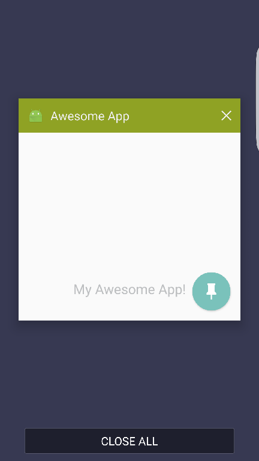
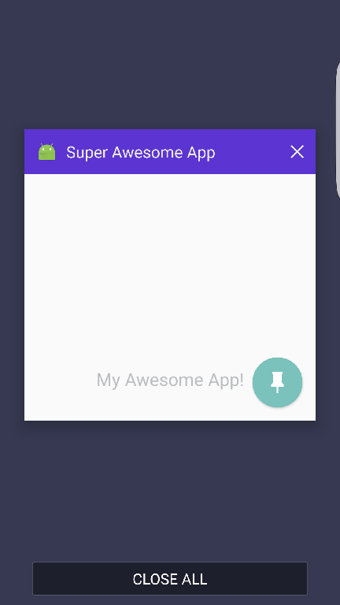

# React Native Android TaskDescription
> Android TaskDescription component for React Native

## Overview

Allows configuration of the [Android TaskDescription](http://developer.android.com/reference/android/app/ActivityManager.TaskDescription.html), allowing
you to change the background color and text of the TaskDescription shown on the recent apps Overview Cards.  Changing the icon is not yet supported.

### Examples

#### Change the color

```javascript
import TaskDescriptionAndroid from 'react-native-android-taskdescription'

  // ...
  render() {
    return (
      <View>
        <TaskDescriptionAndroid background="#8fa224" />
        <Text>My awesome app!</Text>
      </View>
    )
  }
```



#### Change the text

```javascript
import TaskDescriptionAndroid from 'react-native-android-taskdescription'

  // ...
  render() {
    return (
      <View>
        <TaskDescriptionAndroid>
          <Text>Super Awesome App</Text>
        </TaskDescriptionAndroid>
        <Text>My awesome app!</Text>
      </View>
    )
  }
```


#### Change color and text

```javascript
import TaskDescriptionAndroid from 'react-native-android-taskdescription'

  // ...render
  render() {
    return (
      <View>
        <TaskDescriptionAndroid background="##5c34d2">
          <Text>Super Awesome App</Text>
        </TaskDescriptionAndroid>

        <Text>My awesome app!</Text>
      </View>
    )
  }
```



## Installation and setup

### Install

```bash
npm install --save react-native-android-taskdescription
```

### Update android/settings.gradle

```
...
include ':react-native-android-taskdescription'
project(':react-native-android-taskdescription').projectDir = new File(settingsDir, '../node_modules/react-native-android-taskdescription')
```

### Update android/app/build.gradle

```
...
dependencies {
  ...
  compile project(':react-native-android-taskdescription')
}
```

### Register module in `MainActivity.java`

```java
  import com.jwarby.reactnativetaskdescription.TaskDescriptionPackage; // <------- Add the import

  // ...
  @Override
  protected List<ReactPackage> getPackages() {
    return Arrays.<ReactPackage>asList(
      new MainReactPackage(),
      new TaskDescriptionPackage(this) // <------- Add package - make sure you pass 'this' to the constructor!
    );
  }
```

## Changelog

- `14th April 2016` - `v0.1.0` - First released version
